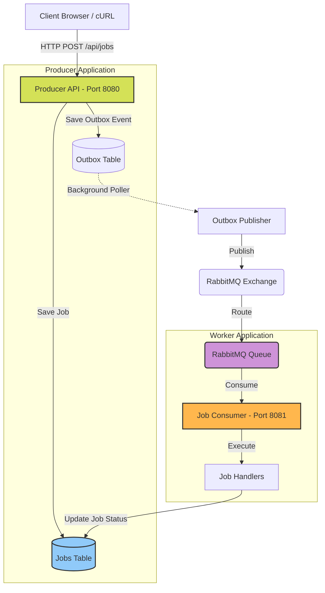

# Distributed Job Orchestration

A highly resilient, scalable, and distributed job orchestration system built with Java, Spring Boot, RabbitMQ, and PostgreSQL. 

This system is designed to handle asynchronous background tasks with strong guarantees around message delivery, idempotency, and concurrency control. It employs Enterprise Integration Patterns to ensure robust operation even when system components fail.

## Architecture Overview

The system is physically decoupled into two independently scalable microservices communicating via an event-driven architecture.



1. **Producer (API & Scheduler):** Receives HTTP requests, validates them, and writes job intent to the PostgreSQL database. It utilizes the **Transactional Outbox Pattern** to guarantee message delivery to the broker.
2. **Worker (Execution Engine):** Consumes messages from RabbitMQ, executes the associated business logic, and updates the database state safely using **Optimistic Locking**.
3. **Common (Anti-Corruption Layer):** A pure Java library shared between the Producer and Worker, defining the domain language (Enums, State Machines, Message Contracts) without Spring dependencies.

## Key Features & Design Patterns

- **Transactional Outbox Pattern:** Solves the "Dual Write" problem. Job state and outbound message payloads are saved in a single atomic database transaction, ensuring at-least-once delivery even during broker outages.
- **Idempotent Consumers:** Workers safely handle duplicate message deliveries. An `idempotency_key` guarantees API-level idempotency, while optimistic locking (`@Version`) prevents the lost-update anomaly.
- **State Machine Enforcement:** Job state transitions (e.g., PENDING -> QUEUED -> PROCESSING -> COMPLETED) are strictly enforced via a centralized, immutable state machine.
- **Resilient Messaging:** 
  - **Delayed Retries:** Implemented via RabbitMQ Time-To-Live (TTL) queues without requiring external broker plugins.
  - **Dead Letter Queue (DLQ):** Exhausted or unroutable jobs are safely parked in a DLQ for manual inspection.
- **Multi-Module Maven Build:** Clean separation of concerns preventing domain leakage.

## Tech Stack

- **Backend:** Java 21, Spring Boot 3.x, Spring Data JPA, Spring AMQP
- **Database:** PostgreSQL (with JSONB support and GIN indexing)
- **Message Broker:** RabbitMQ
- **Build Tool:** Maven
- **Infrastructure:** Docker & Docker Compose

## Project Structure

```text
distributed-job-orchestration/
├── common/          # Shared domain models, enums, and pure Java logic
├── producer/        # Spring Boot app: REST API, Outbox Publisher
├── worker/          # Spring Boot app: RabbitMQ Consumers, Job Handlers
├── docs/            # Architecture deep dives and documentation
└── pom.xml          # Parent reactor POM
```

## Walkthrough: Running and Validating the System

Follow these steps to run the complete orchestration system locally and validate its core functionality.

### Prerequisites
- JDK 21+
- Docker & Docker Compose
- Maven 3.8+

### Step 1: Start Infrastructure
First, start the PostgreSQL database and RabbitMQ message broker.
```bash
docker-compose up -d
```
You can verify RabbitMQ is running by visiting the Management UI at `http://localhost:15672` (default credentials: `guest` / `guest`).

### Step 2: Build the Project
Compile the parent project and all its submodules.
```bash
mvn clean install
```

### Step 3: Run the Applications
You will need two separate terminal windows to run the microservices.

**Terminal 1 - Start the Producer:**
```bash
cd producer
mvn spring-boot:run
```
*The producer will start on port 8080.*

**Terminal 2 - Start the Worker:**
```bash
cd worker
mvn spring-boot:run
```
*The worker will start on port 8081.*

### Step 4: Validate Job Execution
Let's simulate a client requesting a new background job.

Run the following command to submit an `EMAIL` job to the Producer API:
```bash
curl -X POST http://localhost:8080/api/jobs \
  -H "Content-Type: application/json" \
  -d '{
    "jobType": "EMAIL",
    "priority": "HIGH",
    "payload": {
      "to": "user@example.com",
      "subject": "Welcome to the platform!"
    }
  }'
```

**Expected JSON Response:**
```json
{
  "jobId": "f47ac10b-58cc-4372-a567-0e02b2c3d479",
  "status": "PENDING",
  "idempotencyKey": "f47ac10b-58cc-4372-a567-0e02b2c3d479",
  "message": "Job successfully created and scheduled for execution."
}
```

**What happens behind the scenes:**
1. The **Producer** receives the request, generates a UUID for the job, and starts a database transaction.
2. It writes the job in `PENDING` state to the `jobs` table, and an Outbox event to the `outbox_events` table, then commits.
3. The Outbox Poller in the Producer picks up the event and publishes it to the `jobs.exchange` in RabbitMQ.
4. The **Worker** receives the message from `jobs.queue`.
5. The Worker updates the job status in PostgreSQL to `PROCESSING`.
6. The Worker routes the payload to the `EmailJobHandler`, executing the business logic.
7. Finally, the Worker updates the job status to `COMPLETED`.

**Expected Terminal Output (Worker):**
```text
[job-worker-1] INFO  c.j.w.consumer.JobConsumer - Received message for Job: f47ac10b-58cc-4372-a567-0e02b2c3d479
[job-worker-1] INFO  c.j.w.s.JobExecutionService - Transitioning Job f47ac10b... from QUEUED to PROCESSING
[job-worker-1] INFO  c.j.w.h.EmailJobHandler - Sending email to user@example.com with subject: Welcome to the platform!
[job-worker-1] INFO  c.j.w.s.JobExecutionService - Transitioning Job f47ac10b... from PROCESSING to COMPLETED
```

You can observe these transitions happening in real-time by checking the console logs of both the Producer and Worker terminals.

### Step 5: Validating Idempotency
Try running the exact same `curl` command again but include an `idempotencyKey`:

```bash
curl -X POST http://localhost:8080/api/jobs \
  -H "Content-Type: application/json" \
  -d '{
    "jobType": "EMAIL",
    "idempotencyKey": "email-welcome-12345",
    "priority": "HIGH",
    "payload": {
      "to": "user@example.com",
      "subject": "Welcome!"
    }
  }'
```

**Expected JSON Response (On Duplicate Request):**
```json
{
  "jobId": "a1b2c3d4-e5f6-7890-1234-56789abcdef0",
  "status": "COMPLETED",
  "idempotencyKey": "email-welcome-12345",
  "message": "Job previously created and executed."
}
```

If you run this multiple times, the Producer will recognize the `idempotencyKey`, intercept the duplicate request, and simply return the state of the existing job without scheduling a duplicate execution or inserting duplicate database rows.

## Deep Dive Documentation
For a complete understanding of every design decision, edge case, and code pattern used in this project, please read the [Architecture Deep Dive](docs/architecture-deep-dive.md).

## License
This project is licensed under the MIT License.
